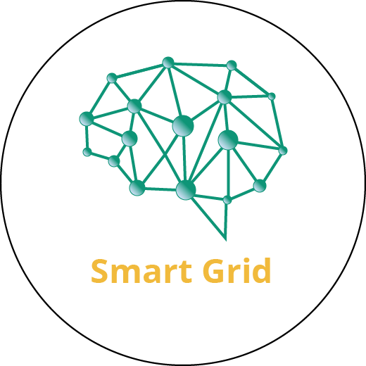

# SmartGrid

## Proyecto para el monitoreo de microrredes eléctricas
Este repositorio corresponde a la aplicación desarrollada con React Native para el monitoreo de microrredes

## Repositorios relacionados

- [Servidor REST-API](https://github.com/EnriqueSaro/microgridAPI)
- [Servidor TCP](https://github.com/EnriqueSaro/smartgrid-tcp-nodejs-server)
- [Módulo de monitoreo](https://github.com/KarlaPaolaOlivera/modulo-monitoreo)